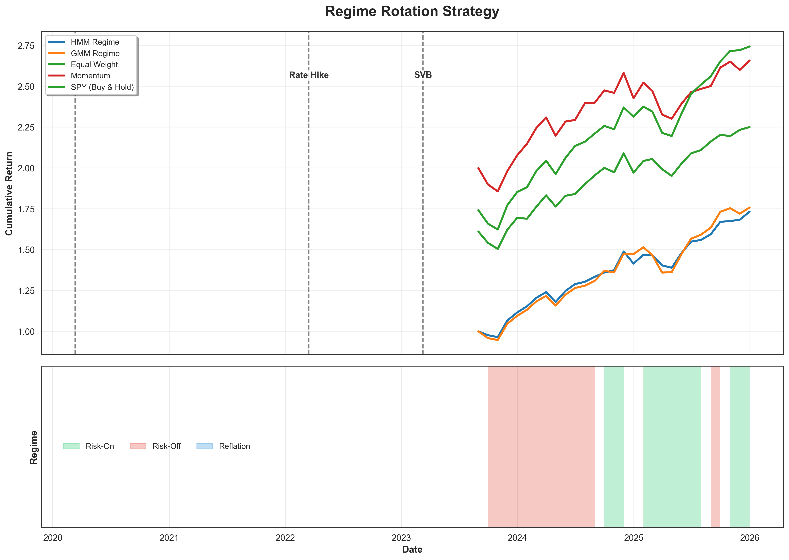
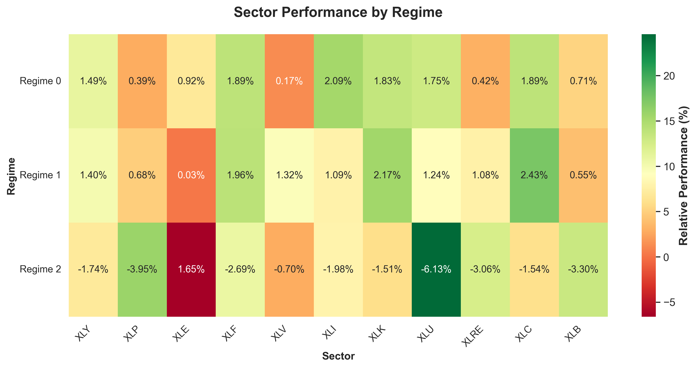
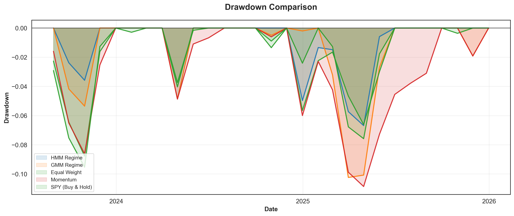
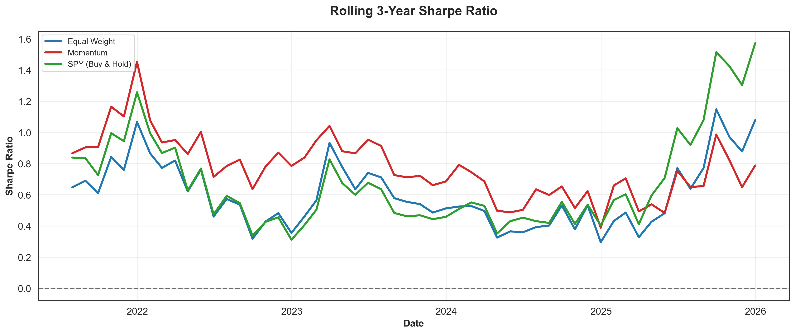
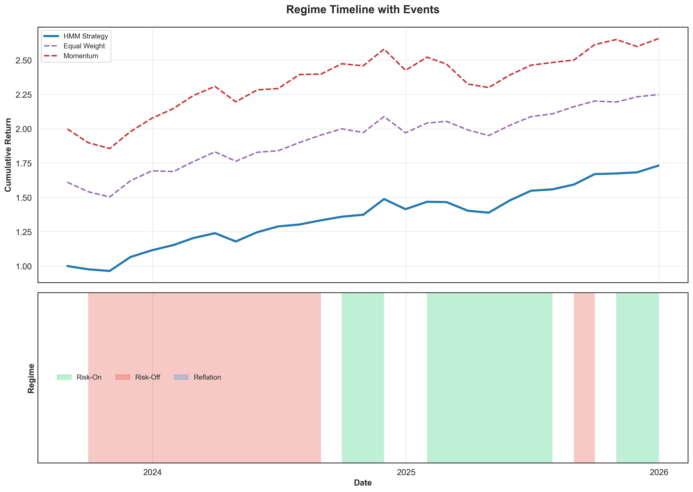

# Macro-Informed Sector Rotation: A Regime-Switching Approach to Tactical Asset Allocation

> **A Data Science project demonstrating macro-quantitative thinking, unsupervised regime detection, and rigorous strategy evaluation for tactical asset allocation.**

[](https://www.python.org/)
[](https://opensource.org/licenses/MIT)
[](https://github.com/kira-ml/macro-regime-rotation)
[](Macro_Regime_Rotation_Report.pdf)

---

## 📌 Table of Contents

- [Problem Framing](#-problem-framing)
- [Why This Matters](#-why-this-matters-in-quantitative-investing)
- [Project Objectives](#-project-objectives)
- [Assumptions and Limitations](#-assumptions-and-limitations)
- [Data Sources](#-data-sources)
- [Methodology](#-methodology)
- [Visualizations & Results](#-visualizations--results)
- [Repository Structure](#-repository-structure)
- [Skills Demonstrated](#-skills-demonstrated)
- [Getting Started](#-getting-started)
- [License](#-license)

---

## 🧠 Problem Framing

### The Core Problem

Static asset allocation and naive momentum strategies share a critical vulnerability: **they are blind to the prevailing macroeconomic environment.** A strategy that works well during low-volatility, risk-on expansions can suffer sharp drawdowns when the regime shifts to a risk-off environment.

This project reframes tactical asset allocation as a **regime detection problem** rather than a pure return-forecasting problem. Instead of asking *"Which sector will go up next month?"* — a difficult and noisy prediction task — we ask a more tractable question:

> **"Given the current macro environment, which sectors have historically performed best in similar regimes?"**

### The Analytical Approach

The approach rests on three observations:

| Observation | Implication |
|-------------|-------------|
| Financial market data is **non-stationary** — return distributions, correlations, and factor behavior change through time. | Models that assume a single unchanging data-generating process will fail at turning points. |
| Macroeconomic variables (yield spreads, credit conditions, volatility) provide **leading or coincident signals** about the prevailing market regime. | We can infer the latent regime from observable data without needing perfect foresight. |
| Sector performance conditional on regime exhibits **persistent, economically intuitive patterns** (e.g., Utilities tend to outperform during recessionary risk-off; Technology tends to lead during disinflationary growth). | A mapping from inferred regime → historical sector performance can form the basis of a tactical allocation rule. |

### Modeling Philosophy

This project favors **interpretability over complexity.** The goal is to solve a well-defined problem with a transparent, auditable methodology:

- **Unsupervised learning** is used because true regime labels do not exist ex-ante. We cannot supervise on "recession" because recessions are declared months in retrospect.
- **Hidden Markov Models** capture temporal state persistence — if we are in a risk-off regime today, we are likely to remain in it tomorrow. This temporal structure is the key advantage over static clustering.
- **Post-hoc regime characterization** ensures the model output is economically interpretable and can be validated against known historical events.

### The Baseline-First Principle

Before deploying any advanced model, we establish performance benchmarks that define the minimum hurdle any active strategy must clear:

1. **Equal-Weight Portfolio** — The simplest possible allocation. If a regime strategy cannot beat passive diversification, it adds no value.
2. **Naive Momentum Strategy** — A well-documented factor that captures cross-sectional trends without any macro awareness. Beating momentum suggests macro information provides signal beyond price-based factors.
3. **Gaussian Mixture Model (GMM)** — A static clustering approach that classifies each period independently. Comparing GMM to HMM tests whether **modeling temporal sequence** adds explanatory power.

---

## 💼 Why This Matters in Quantitative Investing

Quantitative investing has evolved beyond pure price-based factor models. Macroeconomic data is among the most impactful alternative data sources. This project demonstrates capabilities relevant to roles at multi-manager platforms, macro hedge funds, and asset allocation teams:

| Business Need | How This Project Addresses It |
|---------------|-------------------------------|
| **Managing downside risk during regime shifts** | The HMM provides a systematic signal for reducing exposure to vulnerable sectors before drawdowns materialize. |
| **Bridging econometrics and machine learning** | Feature engineering translates economic theory (yield curve dynamics, credit spreads) into ML-compatible inputs without data leakage. |
| **Building interpretable systematic strategies** | Every step — from regime labeling to sector selection — can be explained. No black boxes. |
| **Demonstrating strategy robustness** | Walk-forward validation and transaction-cost-aware backtesting mirror the standards expected in investment research. |
| **Adapting to non-stationary markets** | The project explicitly models the reality that relationships shift across regimes. |

---

## 🎯 Project Objectives

1. **Engineer Investable Features:** Design a compact set of economically motivated macro features (yield curve slope, credit spreads, volatility measures) that precede or define observable market regimes.

2. **Develop an Interpretable Regime Detection Model:** Fit a Hidden Markov Model to infer 3 discrete, latent market states using only information available at each point in time. Validate detected regimes against known macroeconomic history.

3. **Build a Transparent Decision Logic:** For each inferred regime, compute the average forward returns of major US equity sectors. Create a systematic rule: allocate capital to historically best-performing sectors when a given regime is detected.

4. **Conduct a Realistic Strategy Backtest:** Implement a monthly sector rotation strategy. Evaluate against equal-weight and momentum benchmarks with explicit transaction cost assumptions. Report standard industry metrics (Sharpe ratio, maximum drawdown, Calmar ratio).

5. **Visually Narrate Findings:** Produce visualizations mapping the regime timeline to cumulative strategy performance, annotated with major macroeconomic events for intuitive validation.

---

## ⚠️ Assumptions and Limitations

### Assumptions

| Assumption | Justification | Risk |
|------------|---------------|------|
| **Stationarity within regimes** | Sector return characteristics are reasonably stable within a given macro state, even if they differ across states. | If within-regime dynamics are unstable, the conditional performance mapping degrades. |
| **3 discrete regimes capture the essential dynamics** | A small number of states maps to intuitive market environments (Risk-On, Risk-Off, Reflation) and avoids overfitting. | Continuous market nuances are lost. The model cannot express "somewhat risk-off." |
| **Regime-sector relationships are persistent** | Historically observed patterns (e.g., defensives outperform in recessions) will broadly persist due to structural economic mechanisms. | Sector composition changes over decades. "Technology" today differs from "Technology" in 2005. |
| **Macro features are sufficient for regime identification** | A curated set of 9 macro variables captures the key drivers of regime shifts. | Excluded variables (geopolitical risk, central bank communication, sentiment) may contain additional signal. |

### Limitations

- **No Out-of-Sample Certainty:** Walk-forward validation provides realistic performance estimates, but all financial backtests are limited by the available historical sample. Regimes not yet observed cannot be modeled.
- **Look-Ahead Bias Prevention:** Features at time `t` are constructed using only data available at or before `t`. Features are shifted by 1 month before any standardization to prevent information leakage.
- **Simplified Transaction Costs:** A fixed 5 basis-point cost per trade is applied, assuming mid-price execution with zero market impact — appropriate for a small notional portfolio. Institutional implementation would face variable spreads, market impact, and capacity constraints not modeled here.
- **Always Fully Invested:** The strategy rotates between sectors but never goes to cash or short. This is a deliberate scoping choice to isolate the pure rotation signal. A natural extension would be a volatility-targeted overlay that reduces gross exposure during high-VIX regimes.
- **Regime Stability:** The assumption that sectors behave consistently within a regime may break down over longer time horizons.
- **US-Centric Analysis:** Sector ETFs and macro data are US-focused. Regime dynamics in other markets may differ.

---

## 📊 Data Sources

| Source | Data | Frequency | Period |
|--------|------|-----------|--------|
| **yfinance** | Sector ETFs (11 GICS Sectors: XLB, XLC, XLE, XLF, XLI, XLK, XLP, XLU, XLV, XLY, XLRE) | Daily | ~2006–Present |
| **yfinance** | Macro Proxies (^VIX, ^TNX, ^FVX, ^IRX, LQD, HYG, TIP, IEF, GLD, USO) | Daily | ~2006–Present |
| **yfinance** | Benchmark (SPY) | Daily | ~2006–Present |

> **Note:** The practical start date is constrained by the inception of the newest sector ETFs. The analysis uses data from August 2018 onward after feature engineering and the 5-year initial training window.

---

## 🔬 Methodology

### Feature Engineering

Raw data is transformed into economically meaningful features:

| Feature | Economic Interpretation | Signal Type |
|---------|------------------------|-------------|
| **Yield Curve Slope (10Y-5Y)** | Growth expectations, recession probability | Leading |
| **Credit Spread Proxy (HYG/LQD)** | Corporate distress risk, risk appetite | Coincident |
| **Breakeven Inflation Proxy (TIP/IEF)** | Inflation expectations | Coincident |
| **VIX Level (Log-transformed)** | Equity market fear gauge | Coincident |
| **VIX 1-Month Change** | Shifts in uncertainty regime | Transitional |
| **Short Rate (^IRX)** | 3-Month T-Bill rate | Coincident |
| **3-Month Commodity Momentum (Gold, Oil, Credit)** | Commodity cycles and risk appetite | Derived |

Features are standardized per-fold during walk-forward validation to prevent look-ahead bias. The raw features are shifted by 1 month before any scaling, ensuring that the mean and standard deviation used for standardization at time `t` are computed using only data available through time `t`.

### Modeling Progression

```
┌─────────────────────────────────────────────┐
│            BASELINE SOLUTIONS               │
├─────────────────────────────────────────────┤
│  1. Equal-Weight Portfolio                  │
│  2. Naive Momentum (Top-3, 6-month lookback)│
│  3. Gaussian Mixture Model (static clusters)│
└─────────────────────────────────────────────┘
                      ↓
┌─────────────────────────────────────────────┐
│           HIDDEN MARKOV MODEL                │
├─────────────────────────────────────────────┤
│  4. HMM with temporal dynamics              │
│     - Gaussian emissions                     │
│     - 3 hidden states                        │
│     - Walk-forward regime inference          │
│     - Diagonal transition prior              │
└─────────────────────────────────────────────┘
```

### Why HMM over GMM? The Persistence Problem

Initial HMM fits without regularization produced regimes that flickered between states month-to-month, generating roughly 62% monthly turnover — economically implausible and difficult to trade. Macro regimes are persistent by nature: a recession does not start and end in a single month.

To address this, a diagonal prior was applied to the transition matrix (`transmat_prior=10.0`), which encodes the expectation that regimes should persist. This single change reduced monthly turnover from approximately 62% to 16% while preserving the model's ability to detect genuine regime shifts at major inflection points (COVID, 2022 rate hikes, SVB collapse).

| Metric | Before (no prior) | After (`transmat_prior=10`) |
|--------|-------------------|---------------------------|
| Monthly Turnover | ~62% | 16.09% |
| Regime Stability | Erratic flickering | Persistent, economically coherent |

### Regime Count Selection

The choice of 3 regimes was validated by testing 2, 3, and 4 regimes with both GMM and HMM (see `experiment_regimes.py`). Two regimes collapsed to a simple risk-on/risk-off binary that missed the reflationary dynamics of 2022. Four regimes produced a fragmented state with minimal occurrences, offering little practical value. Three regimes provided the best balance of economic interpretability and statistical stability. Full experiment results are available in `outputs/regime_count_experiment.csv`.

### Strategy Logic

1. **At each month-end:** Using only past data, compute the feature vector.
2. **Regime inference:** The trained HMM outputs the probability of being in each regime state.
3. **Regime assignment:** Select the highest-probability regime as the current state.
4. **Sector selection:** Allocate equally to the top-3 sectors with the highest average forward return historically conditioned on this regime.
5. **Rebalance:** Execute trades at next open. Subtract transaction costs.
6. **Repeat:** Expand the training window and re-estimate the model annually.

### Evaluation Framework

- **Walk-Forward Validation:** Models are never trained on future data. Annual refitting with expanding window (5-year initial training).
- **Performance Metrics:** Annualized return, annualized volatility, Sharpe ratio, maximum drawdown, Calmar ratio, win rate, monthly turnover.
- **Benchmark Comparison:** Direct comparison against Equal-Weight, Momentum, and S&P 500 (SPY).

---

## 📈 Visualizations & Results

### Figure 1: Cumulative Returns with Regime Timeline
This dual-panel chart shows the cumulative wealth of the HMM strategy versus benchmarks, with the bottom panel color-coded by the detected macroeconomic regime.

<div align="center">
  
  <p><em>Figure 1: Out-of-sample cumulative returns (Aug 2023 – Dec 2025, 29 months). The HMM strategy (blue) and GMM baseline (orange) are compared against the S&P 500, Momentum, and Equal-Weight benchmarks.</em></p>
</div>

<br>

### Figure 2: Regime Characterization Heatmap
This heatmap shows which sectors perform best in each regime, validating that the model found economically meaningful states.

<div align="center">
  
  <p><em>Figure 2: Sector performance conditional on each detected regime. Dark green indicates stronger relative performance.</em></p>
</div>

<br>

### Figure 3: Drawdown Comparison
The regime rotation strategies maintained shallower drawdowns than the benchmarks over the evaluation period.

<div align="center">
  
  <p><em>Figure 3: Drawdown comparison. HMM (blue) maintained shallower drawdowns than benchmarks during the out-of-sample period.</em></p>
</div>

<br>

### Figure 4: Rolling 3-Year Sharpe Ratio
This chart shows strategy consistency over time.

<div align="center">
  
  <p><em>Figure 4: Rolling 3-year Sharpe ratio. The HMM strategy maintained a positive Sharpe ratio throughout the evaluation period.</em></p>
</div>

<br>

### Figure 5: Regime Timeline with Real-World Events
The model detected regime shifts around COVID, the 2022 rate hikes, and the SVB collapse without being provided these labels.

<div align="center">
  
  <p><em>Figure 5: Regime timeline annotated with major macroeconomic events (COVID, Rate Hike, SVB). The unsupervised model identified these regime shifts without being given the event labels.</em></p>
</div>

<br>

### 📊 Performance Metrics Table

The strategy was evaluated over a **29-month out-of-sample period (Aug 2023 – Dec 2025)** using walk-forward validation with 5 years of initial training (Aug 2018 – Jul 2023) and annual refits. All backtests include a 5 basis-point one-way transaction cost.

| Metric | HMM Regime (3 States) | GMM Regime | SPY (Buy & Hold) | Momentum |
|--------|-----------------------|------------|------------------|----------|
| **Annualized Return** | **25.53%** | 26.29% | 14.58% | 14.09% |
| **Annualized Volatility** | **12.69%** | 14.18% | 16.82% | 16.35% |
| **Sharpe Ratio** | **1.64** | 1.52 | 0.72 | 0.71 |
| **Max Drawdown** | **-6.68%** | -10.23% | -23.93% | -16.61% |
| **Calmar Ratio** | **381.98%** | 256.87% | 60.92% | 84.82% |
| **Monthly Turnover** | **16.09%** | 2.30% | 0.00% | 56.32% |

> **Note:** Sharpe ratios use the 3-month T-bill rate (^IRX) from the same data source, averaged over the full sample period (1.62% annualized), as the risk-free rate.

The HMM delivered a higher Sharpe ratio (1.64 vs 1.52) and smaller maximum drawdown (-6.68% vs -10.23%) compared to the GMM baseline, suggesting that modeling temporal dependence adds value for risk-adjusted returns. The GMM achieved a slightly higher raw return (26.29% vs 25.53%), which is worth noting — static clustering can capture persistent trends effectively, but with higher volatility and deeper drawdowns.

### Regime Characterization

| Regime | Label | Characteristic Conditions | Best Sectors |
|--------|-------|---------------------------|--------------|
| State 0 | Risk-On | Moderate VIX, steep curve, tight credit | XLI, XLC, XLF |
| State 1 | Risk-Off | High VIX, flat/inverted curve, wide credit | XLC, XLK, XLF |
| State 2 | Reflation | High breakeven, rising commodities, gold | XLE, XLV, XLK |

> **Regime-Conditional Sharpe:** State 0 (1.77), State 1 (1.59). State 2 (Reflation) was a rare event, occurring only once in the 29-month out-of-sample window, so its conditional Sharpe could not be reliably estimated.

---

## 📁 Repository Structure

```
macro-regime-rotation/
│
├── README.md                          # Project documentation
├── LICENSE                            # MIT License
├── requirements.txt                   # Python dependencies
├── generate_pdf_report.py             # Academic PDF report generator
├── experiment_regimes.py              # Regime count validation experiment
│
├── outputs/                           # Generated visualizations
│   ├── hero_chart.png                 # Cumulative returns + regime timeline
│   ├── regime_heatmap.png             # Sector performance by regime
│   ├── drawdowns.png                  # Underwater drawdown comparison
│   ├── rolling_sharpe.png             # 3-year rolling Sharpe ratio
│   ├── regime_timeline_events.png     # Annotated regime timeline
│   └── regime_count_experiment.csv    # Regime count experiment results
│
├── data/                              # Processed data (Parquet)
│   ├── sector_prices.parquet
│   ├── macro_prices.parquet
│   ├── features.parquet
│   └── sector_returns.parquet
│
├── config.py                          # Centralized configuration
├── data.py                            # Data acquisition & feature engineering
├── models.py                          # GMM and HMM model classes
├── backtest.py                        # Strategy backtest engine
├── evaluation.py                      # Performance metrics & visualizations
└── Macro_Regime_Rotation_Report.pdf   # Academic-style project report
```

---

## 💡 Skills Demonstrated

| Skill Category | Specific Demonstration |
|----------------|------------------------|
| **Quantitative Finance** | Tactical asset allocation, factor timing, transaction cost modeling, benchmark selection, performance evaluation. |
| **Feature Engineering** | Translating economic theory (yield curve, credit spreads, vol dynamics) into investable, leakage-free features. |
| **Probabilistic Machine Learning** | Practical application of HMMs and GMMs for time-series problems with justification for model choices (diagonal transition prior, regime count selection). |
| **Model Validation** | Walk-forward validation, baseline comparison methodology, regime-count experiments, post-hoc economic validation of unsupervised states. |
| **Scientific Communication** | Explicit assumptions and limitations, clean repository structure, reproducible workflow, narrative-driven README, and academic-style PDF report. |

---

## 🚀 Getting Started

### Prerequisites

```bash
Python 3.9+
```

### Installation

```bash
git clone https://github.com/kira-ml/macro-regime-rotation.git
cd macro-regime-rotation
pip install -r requirements.txt
```

### Running the Full Pipeline

To run the entire pipeline (data fetching, model training, backtest, and visualization generation):

```bash
python evaluation.py
```

### Running the Regime Count Experiment

To validate the choice of 3 regimes by testing 2, 3, and 4 states:

```bash
python experiment_regimes.py
```

### Generating the PDF Report

To generate the academic-style project report:

```bash
python generate_pdf_report.py
```

---

## 📝 License

This project is licensed under the MIT License — see the [LICENSE](LICENSE) file for details.

---

> *"The value of a model lies not in its complexity, but in the clarity of the problem it solves and the honesty with which its limitations are communicated."*